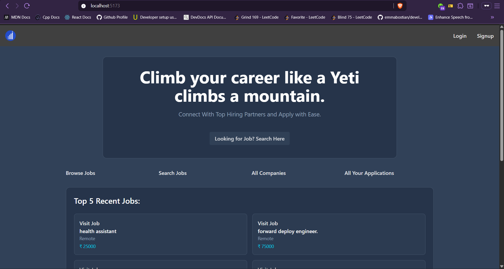
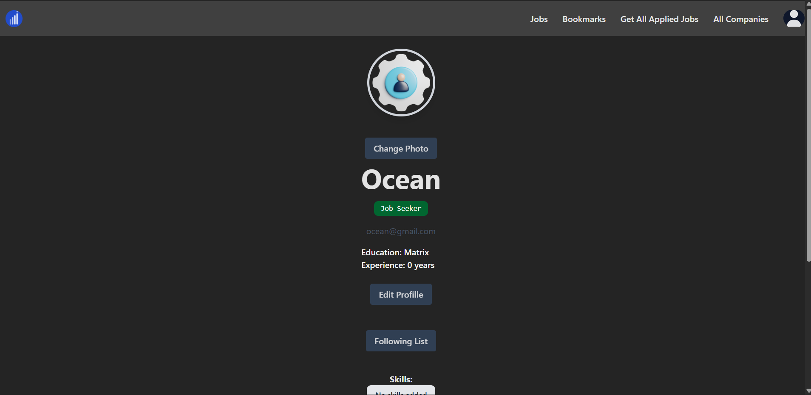
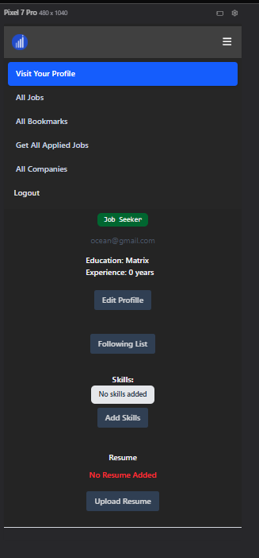
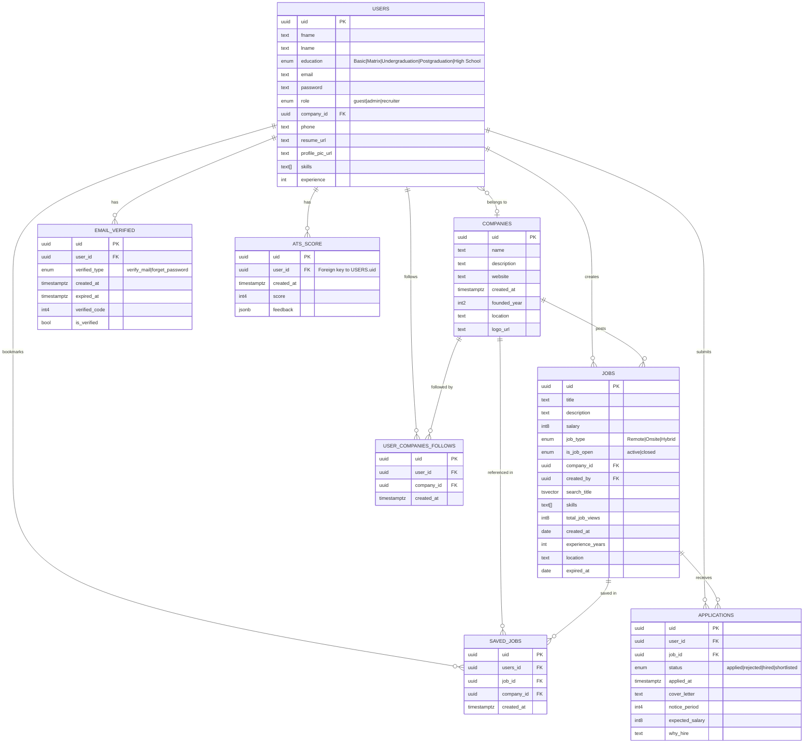

# Yeti Jobs:
A Scalable job portal built with the **PERN stack** that connects job seekers and recruiters with advanced search, application tracking, ATS Scoring and role based access control.

<p align="center">
  <picture>
      
  </picture>
</p>
<p align="center">
  <strong>Climb your career like a Yeti climbs a mountain.</strong>
</p>

## Table of Contents:
1. [Overview](#overview)
2. [Screenshots](#screenshots)
3. [Demo URL](#demo-url)
4. [Tech Stack](#tech-stack)
5. [Architecture Overview](#architecture-overview)
6. [Folder Structure](#folder-structure)
7. [Environment Variables](#environment-variables)
8. [📦 Libraries Used](#libraries-used)
9. [Installation & Setup](#installation--setup)
10. [Docker Setup](#docker-setup)
11. [API Documentation](#api-documentation)
12. [Database Design](#database-design)
13. [Cron Task](#cron-task)
14. [Testing](#testing)
15. [Deployment](#deployment)
16. [Security](#security)
17. [Performance Optimization](#performance-optimization)
18. [Scalability Consideration](#scalability-consideration)
19. [Challenges and Learnings](#challenges--learnings)
20. [Limitation](#limitation)
21. [Something Go Beyond Features](#something-go-beyond-features)
22. [Future Improvements](#future-improvements)


## Overview:
The Project is a Job Portal Platform **with** all the features needed to build a job portal platform, such as CRUD operations, **role-based** access control, jobs, companies, apply, withdraw, create a job, create a new company, admin controller, and a cron queue.
## Screenshots:
<div style="display: flex; justify-content: center; flex-wrap: wrap; gap: 10px;">
    
    
    
    
    
    
</div>

## Demo Url:
- Frontend: https://yeti-jobs.vercel.app
- Backend: https://yeti-jobs.onrender.com/api/v1/
- Backend API Demo: https://yeti-jobs.onrender.com/api/v1/swagger


## Features:
### Job Seekers:
- Apply/Withdraw Job, Add to Bookmark/Remove To Bookmark
- Search Jobs
- Edit Profile And Other Credentials
- Add a Resume/Profile Picture
- View all jobs
- View all applications
- View All Bookmarks
- All Companies List
- Individual Company jobs and Description About Company
- View Single Job
- ATS Scoring And Feedback for Resume

### Recruiters (Employees):
- Company Dashboard
- All Applicants
- See All employees
- See Profile
- Create/Delete/Edit a Job
- Update Company
- Change Applicant **Status**
- Get All **Followers** Company
- Dashboard Stats such as: 
  ``` bash
    All Owned Jobs
    All Applications
    All Employees
    All Followers
  ```

### Admin:
- Assign User to companies.
- Delete/Create/Update Company
- Company Entire Overview dashboard
- Company Dashboard Stats such as: 
  ``` bash
    Total Jobs
    Total Applications
    Open Jobs
    All Followers
  ```
  
### Common:
- Authentication (JWT)
- Email Verification & password reset
- Role based access control.


## Tech Stack:
- Frontend:
  - React
  - TailwindCSS
- Backend:
  - Node.js
  - Express
- Database:
  - Raw PostgreSQL
- Devops:
  - Docker


## Architecture Overview:
- The System follows a layered architecture:
  Client(React) -> API(Express) -> Service Layer -> PostgreSQL
- JWT-base authentication
- Modular services for jobs, applications, companies
- File storage via Supabase

<p align="center">
  <picture>
      
  </picture>
</p>


## Folder Structure

### Backend
- server.js
- src
-- controllers/
-- middleware/
-- models/
-- routes/
-- services/
-- utils/
-- tests/
-- db/

### Frontend
- api/
- components/
- pages/
- hooks/
- context/
- lib/
- data/


## Environment Variables

### Backend
- DATABASE_PASSWORD
- JWT_SECRET_KEY
- NODEMAILER_MY_EMAIL
- NODEMAILER_MY_PASSWORD
- NODEMAILER_MY_host
- SUPABASE_URL
- SUPABASE_ANON_KEY
- CLIENT_BASE_URL
- PORT
- MAXAGE
- GROK_API

### Frontend
- VITE_SERVER_URL


## 📦Libraries Used

| Package | Version | Category |
| ------- | ------- | -------- |
| [](https://npmjs.com/package/react) | `19.2.0` | Frontend |
| [](https://npmjs.com/package/axios) | `1.13.5` | Frontend |
| [](https://npmjs.com/package/react-router) | `7.13.1` | Frontend |
| [](https://npmjs.com/package/react-icons) | `5.6.0` | Frontend |
| [](https://npmjs.com/package/react-toastify) | `11.0.5` | Frontend |
| [](https://npmjs.com/package/react-spinners) | `0.17.0` | Frontend |
| [](https://npmjs.com/package/tailwindcss) | `4.2.1` | Frontend |
| [](https://npmjs.com/package/express) | `^5.2.1` | Backend |
| [](https://npmjs.com/package/jsonwebtoken) | `^9.0.3` | Backend |
| [](https://npmjs.com/package/bcryptjs) | `^3.0.3` | Backend |
| [](https://npmjs.com/package/zod) | `^4.3.6` | Backend |
| [](https://npmjs.com/package/helmet) | `^8.1.0` | Security |
| [](https://npmjs.com/package/express-rate-limit) | `^8.2.1` | Security |
| [](https://npmjs.com/package/cors) | `^2.8.6` | Security |
| [](https://npmjs.com/package/multer) | `^2.0.2` | Upload |
| [](https://npmjs.com/package/nodemailer) | `^8.0.1` | Mail |
| [](https://npmjs.com/package/node-cron) | `^4.2.1` | Jobs |
| [](https://npmjs.com/package/pg) | `^8.18.0` | Database |
| [](https://npmjs.com/package/cookie-parser) | `^1.4.7` | Middleware |
| [](https://npmjs.com/package/dotenv) | `^17.3.1` | Config |
| [](https://npmjs.com/package/@supabase/supabase-js) | `^2.97.0` | Storage |
| [](https://npmjs.com/package/swagger-ui-express) | `^5.0.1` | Documentation |
| [](https://npmjs.com/package/yamljs) | `^0.3.0` | Documentation |
| [](https://npmjs.com/package/openai) | `^6.33.0` | LLM |
| [](https://npmjs.com/package/pdf-parse) | `^2.4.5` | Backend |
| [](https://npmjs.com/package/@vercel/analytics) | `^2.0.1` | Frontend |
| [](https://npmjs.com/package/react-phone-number-input) | `^3.4.16` | Frontend |


## Installation & Setup:
To Run the System to a Local Server, we've to make sure have the muliple of systems for differnet purpose.
Requirements: Node.js, Postgres Server, Supabase Keys, Nodemailer Keys
Backend Configuration:
Here’s the shorter, cleaner version of what you need — straight to the point.
### Backend Requirement:
- **Node.js** – to run the JavaScript code
- **PostgreSQL** – database to store data
- **Supabase keys** – for database + auth (URL + anon key)
- **Nodemailer keys** – to send emails (email + app password)

### Backend Configuration:
``` bash
  cd backend
  touch .env # Create Env File
  vim .env (Insert all the env keys on here)
```
- After inserting all the env keys
``` bash
npm i # Install all our node libraries
node app.js # Run our nodejs server
```
>:white_check_mark: your server will run on the http://localhost:PORT


### Frontend:
``` bash
cd frontend
touch .env
vim .env # Insert a: VITE_SERVER_URL on .env file.
```

``` bash
 npm i:  # Install all our node libraires
 npm run dev  # load our react page to browser
```

>:white_check_mark: your client page will run on the http://localhost:5173


## Docker Setup:
- Docker base has only one single container for the Node.js configuration.
- Use the `node` image.
- In the coming time, I plan to migrate my database to Docker.
- First, build the image of the Node.js application.
``` bash
cd backend
docker build -t yeti-jobs-backend . # on current folder
```
- Now Run the Docker Container:
  ``` bash
  docker run -d -p 3000:3000 --name yeti-jobs-backend: # Run's on the backgound
  ```


## API Documentation
- Swagger UI: https://yeti-jobs.onrender.com/api/v1/swagger
- It Will Provide a Interactive Graphical User Interface to Api Documentation to all our backend endpoints.
- View all available routes (jobs, users, companies, etc.)
- Check request parameters, body, and headers
- See response formats and status codes

## Database Design

The database follows a strict **Separation of Concerns** principle — each table is normalized to handle a single responsibility with high data integrity.

- **Enums** enforce fixed value sets at the database level for fields like `role`, `education`, `job_type`, `application_status`, and `email_verification_type`.
- **Indexes** are applied on frequently queried columns — a GIN index on `jobs.search_title` for full-text search, and btree indexes on `companies.name` and `email_verified.verified_code`.
- **Constraints & checks** validate data at three levels — client, server, and database — ensuring integrity even if upper layers are bypassed.
- **Triggers** automate internal operations such as populating the `search_title` tsvector column on job insert/update.
- **Referential integrity** is handled via `ON DELETE CASCADE` (e.g. deleting a user removes their email verifications and follows) and `ON DELETE RESTRICT` where linked data must be preserved before deletion is allowed.

### Visual Diagram:


## Cron Task:
- A cron task runs at a specific time that we define.
- I'm using cron for jobs that have an expiry time of 30 days. It checks every night at midnight.
- At every noon, the cron node checks if any jobs have expired. If expired, it updates the `is_job_active` column in the `jobs` table to "closed".

## Testing:
- Set up the basic configuration using `jest` and `supertest`, and test only the `/api/v1/jobs` endpoints.
- Add testing using `jest` and `supertest` for all job routes.
- Include only two test routes initially: `/jobs`, `/jobs/:id`, and `/users/login-status`.
- More tests will be added in the coming days, mainly for job and user routes.

### Planned:
- Unit testing
- Integration testing (using supertest)
- Focus on critical routes (auth, jobs, companies)

## Deployment
### Frontend — Vercel
The React app is deployed on Vercel, which auto-detects the Vite setup with no complex configuration needed.

- Add `VITE_SERVER_URL` in Vercel's environment variables dashboard.
- Every push to `main` triggers an automatic redeploy.

### Backend — Render
The Node.js/Express server is deployed as a Web Service on Render.

> **Note:** Vercel does support Express via serverless functions and a `vercel.json` config — it was explored but Render was chosen for its persistent server model, which fits Express better than a serverless environment.

- Uses an IPv6-compatible connection pooler to connect to Supabase PostgreSQL.
- **Cold start:** Render's free tier sleeps after 15 minutes of inactivity. A cron job pings the server every 15 minutes to keep it alive.
- Add all backend environment variables in Render's dashboard before deploying.

### Database & Storage — Supabase
PostgreSQL database and file storage (resumes, profile pictures) are both hosted on Supabase.

**Migrating from localhost to Supabase:**
1. Get the `DATABASE_URL` connection string from Supabase → Settings → Database.
2. Replace the local `host`, `port`, and `user` config with the single `connectionString`.
3. Add `ssl: { rejectUnauthorized: false }` to allow incoming connections from Render.

File uploads are handled via the `@supabase/supabase-js` SDK — files go directly into Supabase Storage buckets and the returned public URL is saved to the database.
## Security:
### validation Security:
- Every major table will have validation from Zod which **checks** the integrity of our data.
- beside the client side validate, server side validation, i also make sure to add the database validation.
- even if user bypass a both client and server validation it can't insert due to the database validation.
- With checking a text pattern, blank/undefined, correct data type, unique constraint,min length max length which are common for the data validation i've implemented.
- Ensure every piece of data maintains database integrity at all times.


### System Security:
- The Most important things that i added here is the rate limiting.
> Rate Limiting:
>> Rate limiting: 200 req/min globally
>>> Reset password: 2 req/min strictly
- use the helmet  for the reponse purpose which remove the `X-Powered` by that the client will not konw which framework we've build without this it'll show it build from the express.
  - Also have  one more feature  it's add 12 more responsive header, for better secuirty purpose of prevent from the `xss attack`.
- Use the `cors` library for only allow my client url dont' allow any external api endpoints which also have a better security feature for avoid a cross side attack.


### Middlewares:
- Validate all incoming requests using middleware on both the client side and the server side to guarantee data consistency and security.
#### Client Validation:
- on the client validation guest can't visit the page of the admin dashboard and the other admin restricted page and also the employee restricted page.
- while the employees only restrict to perform a employee can't apply to the jobs or can't perform and also neither a guest or the admin action.
- admin which have little bit of the freedom but also enforce data on control integrity can't visit the page of the guest or the employee action.
#### Server MIddleware:-
- More than: 9+ middleware for server validation of custom middleware.
- With make the controller user action to the only isJobSekkker, companies contoller to the isEmployee and the admin contoller to the isAdmin.
- with i also validation whether the use is logged in or not, and also whether the user logged in but not verified, whether the user is owner of that routes or not, whether the user given a correct `uuid` which i also validaion that also save some time for invalid ui to check from the database.


## Performance Optimization
### Database
>:white_check_mark: Added **indexing** on frequently queried columns for faster data retrieval
>:white_check_mark: Used `SELECT EXISTS(SELECT 1 ...)` instead of full `SELECT` statements for condition checks — returns `true/false` without fetching rows
>:white_check_mark: Indexed search query fields to ensure faster full-text or filter operations

### API & Server
>:white_check_mark: Validated email domains via Node's built-in `dns/promises` module before attempting to send mail — prevents unnecessary SMTP calls
>:white_check_mark: Implemented **pagination** for job listings to limit payload size per request

### Frontend
>:white_check_mark: Applied **lazy loading** with `React.lazy()` and `Suspense` — components and data are only fetched when needed
>:white_check_mark: Centralized auth state (verified, logged-in status, user role) using `useContext` to avoid redundant checks and prop drilling


## Scalability Considerations
- **API versioning** (`/api/v1`) and **MVC pattern** keep the codebase modular and easy to extend.
- **Global error handling** on both client and server prevents crashes — every error is caught and returned with a proper status code (`2xx`, `4xx`, `5xx`) and message.
- **PostgreSQL full-text search** with a GIN index on `jobs.search_title` replaces slow `ILIKE` prefix queries for job searching.
- **Query optimization** — joins, group bys, and nested queries are tested with `EXPLAIN ANALYZE` to catch slow plans before they hit production.
- **Rate limiting** (200 req/min globally, 2 req/min on reset password) prevents abuse and protects the server from being overloaded by a single user.
- **Caching** is not yet implemented but the architecture is ready for it — currently comfortable handling up to ~10k MAU.
- **Monitoring & observability** is planned for when the user base grows — not a priority at the current scale but will be added before hitting 10k+ users.

## Challenges & Learnings:
* **UI inconsistencies**
  Some components still have minor alignment and responsiveness issues across different screen sizes.

* **Email system reliability**
  Email delivery (verification/reset) lacks robust failure handling, retry mechanisms, and proper logging.

* **Token resend logic**
  Verification and reset token resend flow can create edge cases (e.g., overlapping or unused tokens).

* **Query parameter binding inconsistency**
  A few PostgreSQL queries do not follow consistent parameterized patterns, which may lead to maintainability issues.

* **Limited test coverage**
  Testing is currently focused on selected job routes, leaving other critical modules (auth, companies) under-tested.

* **Cold start latency (backend)**
  Backend hosted on free tier (Render) experiences delays after inactivity.


## Limitations
* **Free-tier infrastructure constraints**
  Hosting (Render + Supabase) limits performance, concurrent users, and scalability.

* **No real-time features**
  Currently lacks real-time communication (e.g., chat, notifications, live updates).

* **No recruiter–candidate communication system**
  There is no direct messaging or interaction between job seekers and recruiters.

* **No caching layer**
  Absence of Redis/CDN caching increases response time under heavy load.

* **Limited scalability (~10k MAU)**
  System is optimized for small to medium scale but not yet production-ready for large-scale usage.

* **Basic monitoring & observability**
  No logging, alerting, or performance monitoring tools (e.g., metrics dashboards).

* **Partial Dockerization**
  Only backend is containerized; database and full system orchestration are not yet implemented.
* **Incomplete feature ecosystem**
 Missing advanced features like:
  * ATS scoring
  * Interview scheduling
  * Notification system
  * Resume parsing

## Additional Features
- Dockerize a entire system with to the nodejs application and also docker ignore some files: `.dockerignore`
- Only Install a system settings where it required on the production not on the development.
- also have the controller and also the abort feature if the request takes longer time dont' wat for more than  a 10 sec.
- now on the react 19 we dont' need: `auth.provider` rather it also work a auth 
- use the portal system for the popup of the some features.
- for previous a page on the profile picturee of the resume to change it i can use: `createObjectURL` to print show it.
- Implement the vercel analytics on client side for the get the stats about the frontend application.
- REcruiter/Company Employee will have full control of change a status of any jobs applicant
- With hr have the full control which use to reject which to move forward to the interview or the hired or rejected hr have full control.
- Add the List of the bruno all api endpoints link to convert to the swagger ui and add the endpoints of: `api/v1/swagger`
- Add the Phone Number In User Information.

> [!NOTE]
> ## Future Improvements:
>-  Add notification/email when a company posts a new job.
> - Real-time chat between recruiters and applicants.
> -  Move from useContext to Redux. 
> - Add logging/monitoring/observability. 
> - Socket.io for real-time features.
> - ATS scoring for any user profile with background jobs queue.
> - interview scheduling system with automated email reminders and video call link generation from Google Calendar API.
> - User can add a their employment_history and shows that employment history to the user page.
> - List of the education history with the college cgpa and degree.
> - Resume parsing Analysis with extract skills education from: `pdf-parser` library.
> - Alert a user only to those which user followed their company with new jobs, must be the background jobs else it'll block the main block.
> - Add the notification page list about notified user about recent events, followed companies notification, recruiter viewed your resume.
> - profile completneess score based on the badged applicant top skills and how much active jobs seeker.
> - On the edit content page if user try to submit a content without any change don't allow them which reduce a less backend request.
> - Adding a CDN to cache our static assets that never changed
> - Move Our Asynchronous operation to the background queue with use services such as: `Kafka`.


<div align="center">

<div align="center">
  <a href="https://yeti-jobs.vercel.app">
    <picture>
      
    </picture>
  </a>
  <h1>Yeti Blues</h1>
<a href="https://github.com/tech-dipesh/yeti-jobs/issues"></a>
</div>

## [Go Back To Top](#yeti-jobs)

## 🙏 Thanks 