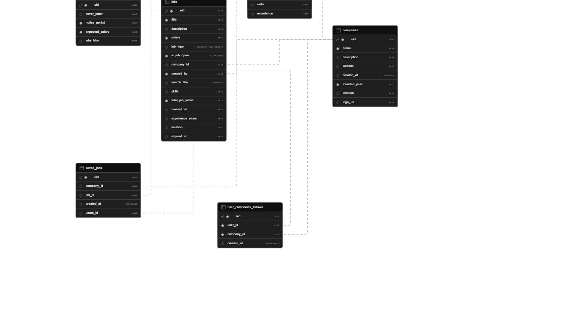

## Yeti Jobs Backend
Backend service for Yeti Jobs built with Node.js, Express, and PostgreSQL, providing secure REST APIs for job management, applications, authentication, and company workflows.

- Project Started: 2026/Feb/19

## API Overview

### Users
- POST /login
- POST /signup
- POST /logout
- GET /:id
- PATCH /:id
- POST /upload-resume
- GET /resume
- POST /upload-profile-picture

### Jobs
- GET /
- GET /search
- GET /:id
- POST /new
- PATCH /:id
- DELETE /:id
- POST /:id/bookmark
- DELETE /:id/remove-bookmark

### Applications
- GET /applylist
- POST /:id/apply
- DELETE /:id/withdraw
- PATCH /:id/status

### Companies
- GET /all
- POST /new
- GET /:id/dashboard
- GET /:id/jobs
- GET /:id/applications

### Admin
- POST /assign-user
- GET /search/users
- GET /search/company
- GET /dashboard

## Core Features
- Job management (CRUD)
- Application system (apply, withdraw, status)
- Company management
- Bookmark jobs
- Followers system
- Email verification and password reset


## Swagger:
- Swagger UI: `https://yeti-jobs.onrender.com/api/v1/swagger`


## Architecture

- Controllers: Business logic
- Services: Reusable logic
- Models: Database + validation
- Routes: API endpoints
- Middleware: Auth, validation, ownership checks

Flow:
Client → Routes → Controllers → Services → Database


  
## Authentication & Security

- JWT authentication (stored in HTTP-only cookies)
- Role-based access control (user, recruiter, admin)
- Password hashing using bcrypt
- Zod validation (request validation)
- Helmet for secure headers
- Rate limiting (anti-brute-force)
- CORS configuration


## File Upload
- Uses Supabase for storage
- Multer with memoryStorage
- Supports resume and profile image upload
- Old files are deleted before new upload
- Use the Pdf Parse And Grok to extract the content.
- Which i'm using the `Grok` library to as a ai for ats scoring and the feedback.
- which top of that i use: `pdf-parse` to extract a text content from user input.


## Performance Optimization

- PostgreSQL indexing on frequently queried fields
- Full-text search using tsvector and GIN index
- SELECT EXISTS optimization
- Pagination using LIMIT and OFFSET
- EXPLAIN ANALYZE for query optimization

## Middleware

- Authentication middleware
- Role-based access middleware
- Ownership validation
- UUID validation
- Error handling middleware


## Email System

- Email verification using OTP
- Password reset workflow
- Token expiration handling
- Resend verification support


## Scheduled Tasks

- Daily cron job to close expired jobs
- Runs at midnight using node-cron


## Scalability Considerations

- Modular MVC architecture
- API versioning
- Optimized database queries
- Stateless backend design


## Database Schema
<p align="center">
  <picture>
      
  </picture>
</p>

## Coming Days Features:
- `npm audit` — check vulnerabilities
- `npm prune` — remove unnecessary packages


## Useful Features:
- Convert string to number with `Number(value)`
- Implemented data validation with Zod
- Used salting and hashing for passwords

- Set up cookies with `httpOnly` flag to store user login status
- Used `cookie-parser` to access cookies as key-value pairs

- Created separate companies table

- Implemented JWT authentication — only logged-in users have access
- Used JWT in cookies (headers are not secure)
- Token handles everything — no need to send UID manually

- Used `Object.keys()` and `Object.values()`
- Created PATCH routes for updating only necessary fields

- In Zod schema: if regex exists, can't add `.required()`
- For min/max values, ensure numbers are properly typed

- Each user has `company_id` as foreign key (nullable by default)
- Added `created_at` timestamp for companies

- Moved routes to controllers for better scalability
- Added `created_by` field with relation to users table

- JWT payload includes: user type (guest/admin), user ID, company_id (if exists)

- Used MVC pattern:
  - **Models** → database + Zod validation
  - **Routes** → connect endpoints to controllers
  - **Controllers** → business logic
  - **Services** → reusable functions (e.g., table fetch)
  - **Middleware** → auth, validation, ownership checks
  - **db.js** → database connection

### March 1–20
- Used `EXPLAIN ANALYZE` for performance analysis
- Fixed Zod array validation issues
- Added `ON DELETE CASCADE` for foreign relations
- Used 3 JOINs to fetch all applicants for a job
- Fixed `experience_years` field naming
- `SELECT EXISTS(SELECT 1)` returns true/false
- Used `z.coerce` for type coercion in Zod

- Recruiters cannot apply to jobs
- Fixed `/:all` routes being captured by `/:id`
- Domain validation with try-catch
- Resend token sends updated token
- Created reusable JWT signing function
- Added `founded_year` and `location` to companies table
- Update the `delete` route which is not a correct logic previously for delete a job.
- Implemented company logo upload feature
- The Bookmark action can't perform by the non job seeker role.
- with change the login status routes of follow rest standard.
- create the indexing on teh verified_code which we need the multiple times so.

- update the profile reset password verify with the correct logic.
- also create the index for the companies name which we need a frequently.
- port our local database to the supabase database.
- Move my system to the src folder structure.
- One really weird bug during the email confirmation is current Date is freezing and sending a old time rather we should do: `new Date()`
- set the limit proxy to allow a render: `set proxy, 1`


## Applications Feature
- Created applications table with: `user_id`, `job_id`, `status`, `applied_at`
- Status is enum type
- Multiple endpoints: admin list, apply, withdraw
- Created validation models
- Added route for companies to see who applied to their jobs

- Fixed issue where status update created new record instead of updating
- Separated controller code from router
- Only owner can view/edit applications


## File Upload (Resume & Profile Picture)
- Used Supabase for file storage
- Used `multer.memoryStorage()` (store in memory, not disk)
- Used `file.buffer` for raw file content
- Required `Content-Type: application/pdf` in bucket
- Access file from `req.file`

**Enable upload policy in Supabase:**
```sql
CREATE POLICY "Allow all" ON storage.objects
FOR ALL TO public USING (bucket_id = 'resume') WITH CHECK (bucket_id = 'resume');
```

**Get public URL:**
```js
supabase.storage.from('bucketname').getPublicUrl(pathurl)
```

- Added `resume_url` column to users table
- Added check: if file exists, delete old one to avoid storage overload
- Same logic applied to profile picture upload


**tsvector & tsquery:**
- `tsvector` — indexed search
- `to_tsquery('help')` — exact match
- `to_tsquery('help:*')` — prefix match
- `to_tsquery('help & right')` — both must exist
- `to_tsquery('help | right')` — one must exist
- `@@` is match operator


## Security Features (2026/02/25)

**Helmet.js:**
- Adds 12 security headers
- Removes `X-Powered-By` (hides Express framework)

**Rate Limiting:**
- Limit: 30 requests per minute per user
- Prevents brute force attacks and ensures stability


## Skills Section
- Added skills array to users
- Skills can only be appended (duplicates prevented)


## Companies Dashboard
- Companies can view:
  - Employee list
  - All jobs
  - Applications (using primary key UID)


## Additional Features
- Added skills array to jobs
- Total job views count — increments on each request
- Dashboard access limited to authorized company owners


## Node Cron Task
- Used `node-cron` for scheduled tasks
- Cron runs daily at midnight: `0 0 * * *`
- Updates jobs to `closed` if expiry date exceeded
- Query: `SELECT * FROM jobs WHERE is_job_open <> 'closed'`


## Versioning & CORS
- Added CORS configuration for client-side
- Correct status codes on every response
- Consistent response messages across all routes


## Email Verification (2026/02/26)
- Used **Nodemailer** with SMTP for encrypted email sending
- Created `email_verified` table with: `uid`, `user_id`, `type`, `email`, `expired`, `is_used`, `created_at`
- Generated 6-digit random code with `Math.random()`
- Used `interval` for time manipulation
- `now()` and `current_timestamp` are same
- Convert ISO string to Date object


## Forget Password
- Similar logic to email verification
- Two routes: send reset request, verify and reset
- Handled edge cases: expired token, already used token, invalid email
- Updated both users table (password) and email_verified table


## Additional Improvements
- Added `ON DELETE CASCADE` for foreign key relations
- Resend verification code feature
- Logout: simply clear cookie from server
- Prevent logged-in users from accessing signup/login pages
- with One things of: `logout` i've to set teh clearCookie to give all the options, `httpOnly, secure, sameSite` which i previously only set when i set a cookies, which cause a conflict on the deployment.
- Also one of the error on the serach instead of: `to_tsquery` which only handle the non space item, rather i can fetch with: `plainto_tsquery` which handle the also a space.

### Testing: 03/30
- Add the Testing from the `jest, supertest` just for all the jobs routes.
- With Just a two testing routes of: `/jobs, jobs/:id, /users/login-status`
- Rest Will coming in the coming days mainly jobs and users routes.

## Packages Used
1. express
2. pg
3. zod
4. bcryptjs
5. cookie-parser
6. jsonwebtoken
7. dotenv
8. @supabase/supabase-js
9. helmet.js
10. express-rate-limit
11. node-cron
12. nodemailer
13. swagger-ui-express
14. yamljs
15. cors
16. multer
17. pdf-parse
18. openai
19. jest
20. supertest


## Post-Feb 26 Features
- Custom ID validation middleware
- DNS domain validation with `dns.resolve`
- Unverified user handling middleware
- Fixed verification code logic
- Proper error handling for already logged-in users
- Removed `is_email_verified` column from users (separate table handles it)
- Validate correct UID everywhere
- Changed status codes in 10+ areas
- Bookmark job testing and fixes
- With Add the Phone Number Cols on the Users db, Add the Regex Phone Number Pattern
- Phone Number Added to Other needed Area


## Application Enhancements
- Added new columns: `cover_letter`, `notice_period`, `expected_salary`, `why_hire`
- Database validation: `expected_salary > 5000`, `why_hire` minimum 10 characters
- Added `shortlisted` status for applications
- One user can apply only once per job
- UUID validation before database request


## Backend Project Completed: 2026/Feb/26


## Docker Setup (March 19)
- Used `npm ci` instead of `npm i` for smaller, faster image
- Added `.dockerignore` to exclude: `node_modules`, `.env`, `Dockerfile`, etc.
- Build command: `docker build -t job_portal .`